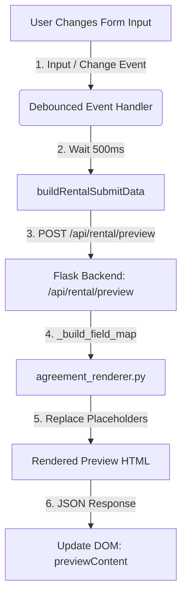

# Guide: Dynamic Form Sections and Real-Time Preview

This guide explains how the Safekeys Rental Agreement form manages dynamic input fields (e.g. adding additional owners/tenants) and generates a live, synchronized document preview on the right-hand side. It covers both the current count-dropdown implementation and how to adapt it for a dynamic "Add/Remove Button" approach.

---

## 1. High-Level Architecture

The feature is built using a clean frontend-backend split:



- **Frontend (`templates/rental_form.html`)**: Listens to changes on the form, shows/hides/injects sections dynamically, and makes debounced asynchronous API requests to fetch updated HTML previews.
- **Backend (`app.py` & `clauses/agreement_renderer.py`)**: Accepts the form state JSON, maps inputs to placeholders, falls back to default placeholder text when values are empty, renders the template HTML, and returns it.

---

## 2. Frontend Implementation (Count Dropdown Approach)
Sections for additional owners (up to 2) and tenants (up to 3) are pre-rendered in the DOM. Their visibility is controlled live via JavaScript listeners on the count dropdowns.

#### 1. Form Change Event Listeners
When `owner_count` or `tenant_count` changes, event listeners trigger visibility toggling:

```javascript
// Live toggle Owner Details 2 when user changes Owner Count
const ownerCountEl = document.getElementById('owner_count');
if (ownerCountEl) {
    ownerCountEl.addEventListener('change', () => {
        const val = parseInt(ownerCountEl.value, 10);
        setOwner2Visibility(!isNaN(val) && val >= 2);
    });
}
```

#### 2. Visibility Controls and Cleanup
When a section is hidden, the hidden fields are cleared, and any `required` validation constraints are removed:

```javascript
function setTenant2Visibility(isVisible) {
    showTenant2Section = !!isVisible;
    tenant2SectionHeader.style.display = showTenant2Section ? '' : 'none';
    tenant2SectionContent.style.display = showTenant2Section ? '' : 'none';
    
    const p31 = document.getElementById('P31');
    if (p31) p31.required = showTenant2Section; // Manage required constraint
    
    if (!showTenant2Section) {
        clearTenant2Inputs(); // Reset values if hidden
    }
}
```

---

## 3. Alternative: Dynamic Button-Based Approach (For Other Applications)

If your form does not use a count dropdown but instead uses **"Add Owner"** and **"Add Tenant"** buttons, follow this pattern:

### A. HTML / Template Structure
Keep a container where you can dynamically inject or clone user details cards, and template markup for the input card:

```html
<!-- Container for dynamic entries -->
<div id="ownersContainer">
  <!-- Owner 1 is always present by default -->
  <div class="owner-card" data-index="1">
    <h3>Owner 1</h3>
    <input type="text" name="owner1_name" placeholder="Owner Name" class="preview-trigger" required>
    <input type="text" name="owner1_address" placeholder="Address" class="preview-trigger">
  </div>
</div>

<!-- Buttons to control count -->
<button type="button" id="addOwnerBtn">+ Add Owner</button>
```

### B. JavaScript for Dynamic Addition & Removal
Instead of showing/hiding static divs, use JavaScript to dynamically append or remove form groups. When you append them, ensure names/IDs contain the index (e.g., `owner2_name`, `owner3_name`) so the preview compiler can map them accurately.

```javascript
let ownerCount = 1;
const maxOwners = 6;

document.getElementById('addOwnerBtn').addEventListener('click', () => {
    if (ownerCount >= maxOwners) return alert("Maximum owners reached");
    ownerCount++;
    
    const container = document.getElementById('ownersContainer');
    
    // Create new owner form inputs
    const ownerCard = document.createElement('div');
    ownerCard.className = 'owner-card';
    ownerCard.dataset.index = ownerCount;
    ownerCard.innerHTML = `
        <hr>
        <div style="display: flex; justify-content: space-between; align-items: center;">
            <h3>Owner ${ownerCount}</h3>
            <button type="button" class="remove-btn" onclick="removeOwner(${ownerCount})">Remove</button>
        </div>
        <input type="text" name="owner${ownerCount}_name" placeholder="Owner ${ownerCount} Name" class="preview-trigger" required>
        <input type="text" name="owner${ownerCount}_address" placeholder="Address" class="preview-trigger">
    `;
    
    container.appendChild(ownerCard);
    
    // Manually trigger preview update since DOM updated
    updatePreview();
});

function removeOwner(index) {
    const card = document.querySelector(`.owner-card[data-index="${index}"]`);
    if (card) {
        card.remove();
        
        // Re-index remaining dynamic cards (if you want consecutive naming like Owner 2, Owner 3)
        reindexOwners();
        updatePreview();
    }
}

function reindexOwners() {
    const cards = document.querySelectorAll('.owner-card');
    ownerCount = cards.length;
    cards.forEach((card, index) => {
        const currentIdx = index + 1;
        card.dataset.index = currentIdx;
        
        // Update labels and input names/placeholders to match the new consecutive index
        const header = card.querySelector('h3');
        if (header) header.innerText = `Owner ${currentIdx}`;
        
        const removeBtn = card.querySelector('.remove-btn');
        if (removeBtn) {
            removeBtn.setAttribute('onclick', `removeOwner(${currentIdx})`);
        }
        
        const inputs = card.querySelectorAll('input');
        inputs.forEach(input => {
            const fieldType = input.name.includes('name') ? 'name' : 'address';
            input.name = `owner${currentIdx}_${fieldType}`;
            input.placeholder = fieldType === 'name' ? `Owner ${currentIdx} Name` : 'Address';
        });
    });
}
```

### C. Adapting the Data Builder and Preview Submission
Your `buildRentalSubmitData` function needs to dynamically collect the values. You can read the current list of dynamic elements from the DOM:

```javascript
function buildRentalSubmitData() {
    const formData = {};
    
    // 1. Gather static fields
    formData.society_name = document.getElementById('society_name')?.value;
    
    // 2. Gather dynamic count
    const activeOwners = document.querySelectorAll('.owner-card');
    formData.owner_count = activeOwners.length;
    
    // 3. Loop over dynamic input names
    activeOwners.forEach(card => {
        const idx = card.dataset.index;
        formData[`owner${idx}_name`] = card.querySelector(`[name="owner${idx}_name"]`)?.value || '';
        formData[`owner${idx}_address`] = card.querySelector(`[name="owner${idx}_address"]`)?.value || '';
    });
    
    return formData;
}
```

---

## 4. Debounced Live Preview Generation

To prevent sending too many requests while a user is actively typing, the preview updater uses a debounce mechanism (500ms delay). Event delegation is used so that newly added dynamic inputs are automatically caught.

```javascript
let previewDebounce = null;

async function updatePreview() {
    const data = buildRentalSubmitData();
    if (!data.society_name) return;

    try {
        const response = await fetch('/api/rental/preview', {
            method: 'POST',
            headers: { 'Content-Type': 'application/json' },
            body: JSON.stringify(data)
        });
        
        if (response.ok) {
            const result = await response.json();
            document.getElementById('previewContent').innerHTML = result.html;
        }
    } catch (err) {
        console.error("Preview generation failed", err);
    }
}

// Event Delegation: Listen for input/change on container which handles dynamically added inputs
document.getElementById('agreementForm').addEventListener('input', (e) => {
    if (e.target.classList.contains('preview-trigger') || e.target.tagName === 'INPUT' || e.target.tagName === 'SELECT') {
        clearTimeout(previewDebounce);
        previewDebounce = setTimeout(updatePreview, 500);
    }
});
```

---

## 5. Backend Adaptation

The backend function `_build_field_map(data)` remains extremely clean because it expects JSON keys like `owner1_name`, `owner2_name`, etc. It doesn't need to know whether these fields were toggled via dropdown or dynamically appended via buttons.

```python
def _build_field_map(data):
    # Retrieve owner_count sent from the dynamic frontend builder
    owner_count = int(data.get("owner_count", 1))
    
    field_map = {
        "{owner_word}": "Owners" if owner_count > 1 else "Owner",
    }
    
    # Dynamically map up to the owner_count
    for i in range(1, owner_count + 1):
        field_map[f"{{owner{i}_name}}"] = data.get(f"owner{i}_name", f"Owner {i} Name")
        field_map[f"{{owner{i}_address}}"] = data.get(f"owner{i}_address", f"Owner {i} Address")
        
    return field_map
```
